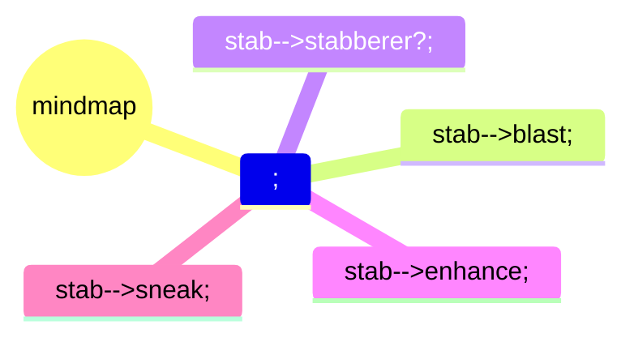

## tooling
battlemaps
  dynamic lighting
  dynamic projection mapping

## setting
[waterdeep](https://forgottenrealms.fandom.com/wiki/Waterdeep)
[yawning portal]

## characters
progression: 2, 3, 5, 9
  martials gain subclasses on 2
    if additional resource dependent, lvl 3 way to incrementally regain

archetypes -> sheets

  

  - pamlock
  - Gloom
  - lifeShepherd
  - peaceChron
monk
2 |-> 3
  |- kensei
  |- open hand

## waterdeep

[map](https://www.aidedd.org/atlas/index.php?map=W&l=1)