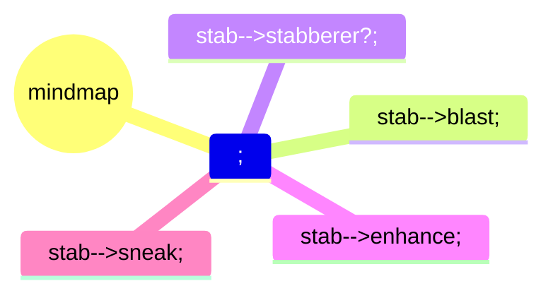

## print
default maps:
- [ ] hex-grid
: default grid
- [ ] determine size
  + mini prints
  #res default build landscape modeling

  -- Papercraft
  ! transformations onto {{print.size :: DIN.A3||DIN.A4 }}
  |-> library: pdf : deskew - print
  | lookup
- [ ]

## flows
### player
character sheet
roll dice

display: initiative

## tooling

## visualization
battlemaps
  dynamic lighting
  dynamic projection mapping

miniatures

## setting
[waterdeep](https://forgottenrealms.fandom.com/wiki/Waterdeep)
[yawning portal]

## characters
progression: 2, 3, 5, 9
  martials gain subclasses on 2
    if additional resource dependent, lvl 3 way to incrementally regain

archetypes -> sheets

  

  - pamlock
  - Gloom
  - lifeShepherd
  - peaceChron
monk
2 |-> 3
  |- kensei
  |- open hand

## waterdeep

[map](https://www.aidedd.org/atlas/index.php?map=W&l=1)

## campaign-specifics
{{dnd.campaign}}
  +.session