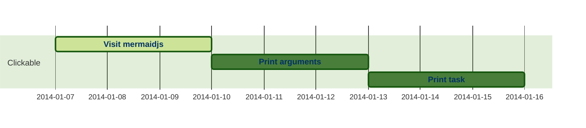

webfront
  MVP
  server

tooling: roaming railroad
  git
  dendron - polyglot notebooks - projektplanung
    vscode cleanup
  data and derivatives
    rev proxy: node on ios
    data analysis
sticks and stones
  leverless openframe1 controller
  fingerboard - frame
    tensegrite fingerboard
      slantboard convertible with:
    tensegrite stick/monopod
dnd character tools
  sheet consumer interface
  sheet printer designs
  extendible markup integration
    dendron
    vscode -> tooling

![[dendron://task/ds.project.webapp]]

page :: wordpress
  - [ ] content selector -> content | shop

## project.names
![[dendron://task/ds.project.wikilinking]]

sideproj
  data-aggregation
  ios shortcut
    reflection | introspection
    uri-scheme rev proxy
    -> ingress/api gateway
  charting
  : intent::

subproj
  - server architecture(headless rpi swarm)
  - leverless controller
  - grip-implements
    - extendable

## projektaufbau
name/beschreibung
kompetenzen & persönliche entwicklung
DoD - milestones [max/min]
zeitplan - PoA
Budget
