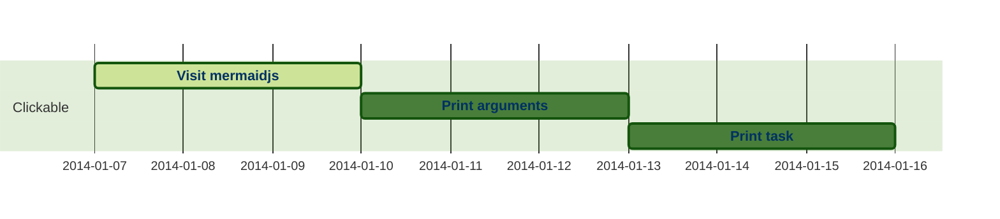

![[webapp|dendron://task/project.ds.webapp]]

page :: wordpress
  [] content selector -> content | shop

## project.names
![[Wikilinking|dendron://task/project.ds.wikilinking]]

sideproj
  data-aggregation
  ios shortcut
    reflection | introspection
    uri-scheme rev proxy
  charting
  : intent::

subproj
  - leverless controller
  - grip-implements
    - extendable

## projektaufbau
name/beschreibung
kompetenzen & persönliche entwicklung
DoD - milestones [max/min]
zeitplan - PoA
Budget
